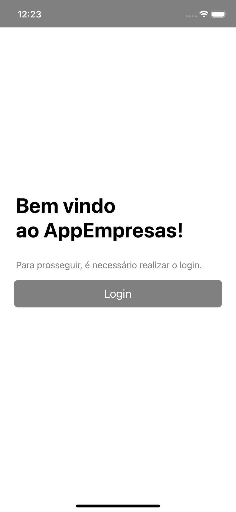
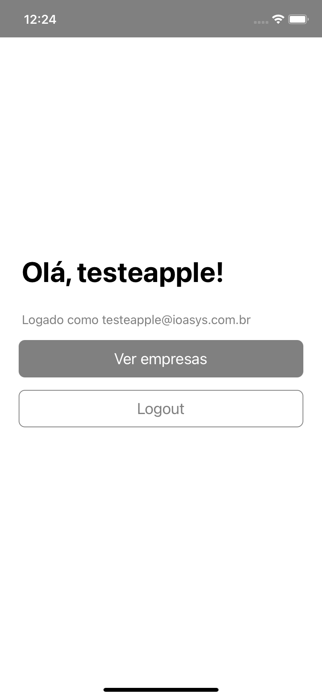
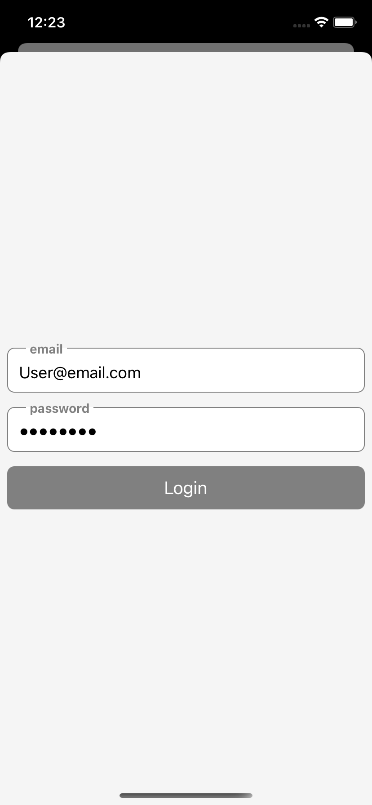

## Bibliotecas & ferramentas utilizadas
- Functional Componentes + React Hooks: Optei por utilizar esse padrão por ser a recomendação da comunidade, além de proporcionar melhor performance dos componentes e facilidade de codificação;
- typescript: utilizei o typescript no projeto pois a tipagem deixa a programação mais fluída, além de proporcionar outros recursos como a utilização de classes;
- redux | react-redux: utilizei por facilitar o gerenciamento de estados globais ou estados complexos que são compartilhados entre componentes;
- react-native-navigation: lib mantida pela wix, se mostra uma boa opção em relação ao react-navigation, pois o fluxo de navegação pode ser implementado com mais facilidade;
- styled-components: utilizei por facilitar a aplicação de tema e a separação de responsabilidades visuais dos componentes;
- axios: utilizei por ser de fácil utilização para consumo de APIs REST além de ser uma biblioteca já consolidada na comunidade.

## Funcionalidades
O aplicativo conta com as funcionalidades:
- Página Inicial com saudações
    - redirecionamento para login se deslogado;
    - redirecionamento para página de Lista de Empresas ou ação de logoff caso logado;
- Página de autenticação com email e senha;
- Página de listagem de empresas;
    - Filtro por categoria de empresa;
    - Busca por nome da empresa;
- Página de detalhes da empresa;

## ScreenShots

Fluxo de autenticação:




## Rodando o projeto em ambiente de desenvolvimento
Para rodar o projeto localmente em ambiente de desenvolvimento, você deve primeiramente clonar este repositório.
Criar um arquivo ```.env``` na pasta ```empresas-react-native/AppEmpresas/``` com as variáveis:
```
BASE_URL='<BASE_URL>' // ex: BASE_URL='https://sample.domain.com.br'
API_VERSION='<API_VERSION>' // ex: API_VERSION='/api/vX'
```
Instalar as dependências a partir da pasta ```empresas-react-native/AppEmpresas/```.

```
npm install
cd ios && pod install
cd ..
```
Inicializar o bundler
```
npm run start
```
Para rodar no sistema operacional Android, assegure-se que o emulador ou o device esteja conectado ao computador.
Para verificar, basta digitar no terminal e verificar se o device aparece listado:
```
adb devices
```
Inicializar o build em modo depuração.
Android:
```
npm run android
```
iOS:
```
npm run ios
```

